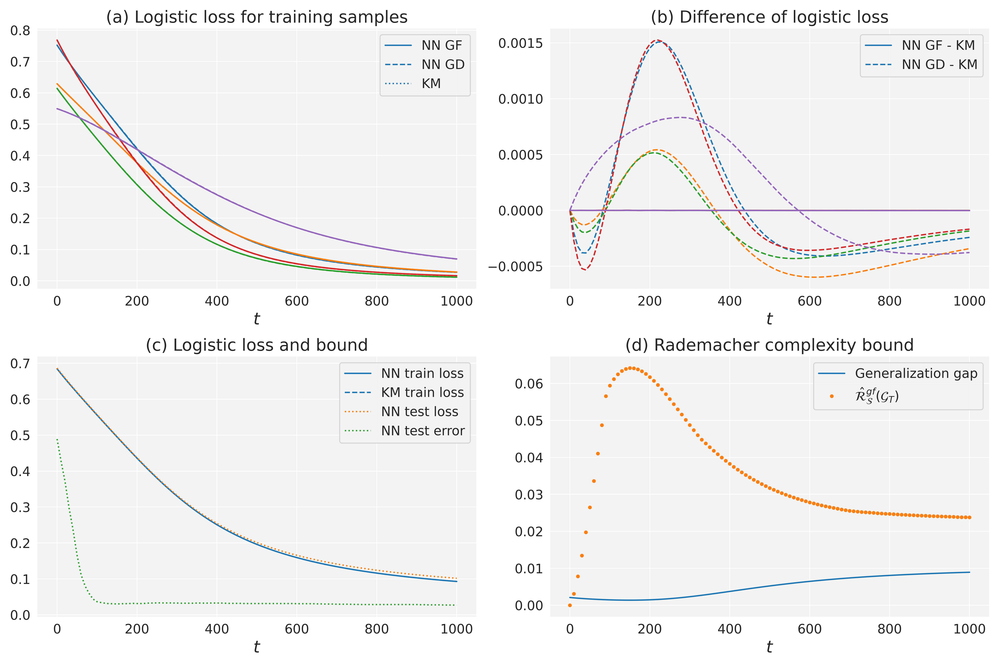
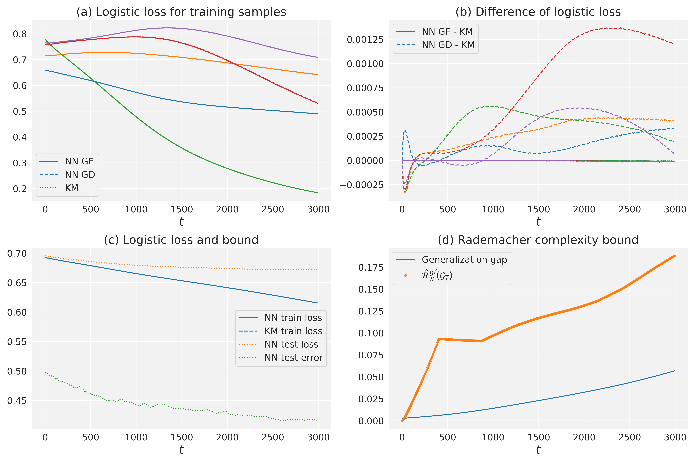
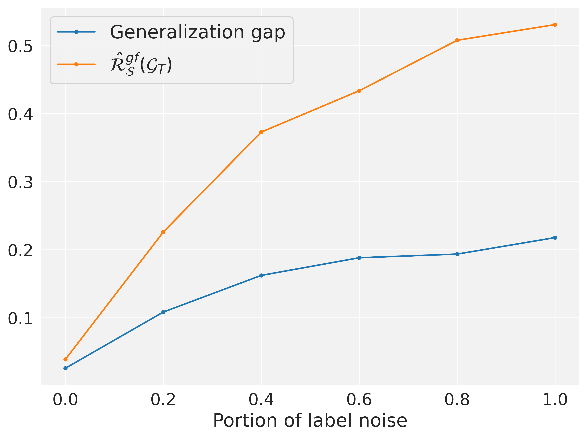

# Analyzing Generalization of Neural Networks through Loss Path Kernels
This is the official repository for the paper ["Analyzing Generalization of Neural Networks through Loss Path Kernels"](https://openreview.net/forum?id=8Ba7VJ7xiM&referrer=%5BAuthor%20Console%5D(%2Fgroup%3Fid%3DNeurIPS.cc%2F2023%2FConference%2FAuthors%23your-submissions)), NeurIPS 2023.
We establish a new connection between the loss dynamics of
gradient flow and general kernel machines by proposing a new kernel, called
*loss path kernel* (LPK). This kernel measures the similarity between two data points by
evaluating the agreement between loss gradients along the path determined by the
gradient flow. Based on this connection, we derive a new generalization upper
bound that applies to general neural network architectures. This new bound is tight
and strongly correlated with the true generalization error.

# Setup
This code has been tested on the below environments:
```
python==3.8.8
pytorch==1.13.1
torchdiffeq==0.2.4
```
Required packages can be installed using `Conda` as follows,
```
conda create -n nn-lpk python=3.8
conda activate nn-lpk
# pytorch==1.13.1 CUDA 11.6 version
conda install pytorch==1.13.1 torchvision==0.14.1 torchaudio==0.13.1 pytorch-cuda=11.6 -c pytorch -c nvidia
conda install numpy tqdm matplotlib seaborn pyyaml
pip install torchdiffeq==0.2.4 easydict==1.9
```
For the installation of `PyTorch`, please reference the instructions in https://pytorch.org/. 


# Experiments

#### (I) Generalization bound in Corollary 1.
For MNIST, run
```
python gene_gd.py --config config/mnist.yaml
```
This includes solving gradient flow ODE, calculating the equivalent LPK, and training the NN with gradient descent.
By default, it will run 20 S' (sampled with different random seeds).
Then calculate and plot the bound using
```
python cal_bound.py --dataset mnist
```


For CIFAR-10,
```
python gene_gd.py --config config/cifar10.yaml
python cal_bound.py --dataset cifar10
```
Solving gradient flow ODE for CIFAR-10 can be kind of slow.



#### (II) Generalization bound with label noise.
Run `gene_gd.py` with different noise levels `[0, 0.2, 0.4, 0.6, 0.8, 1]`. Change the noise level in `config/mnist_noise.yaml`.
```
python gene_gd.py --config config/mnist_noise.yaml
```
Then calculate and plot the bound using
```
python plot_label_noise.py
```

[//]: # (![label_noise]&#40;figs/label_noise.png&#41;)


#### (III) Compute $U_{\infty}$ and the bound in ( Cao & Gu, 2019).
```
python gene_inf.py
```
This experiment requires `neural-tangents==0.6.1`.
For the installation and usage of `neural-tangents`, please reference the instructions at https://github.com/google/neural-tangents.

#### (IV) Neural architecture search (NAS) with LPK.
The code of NAS experiment is based on [TENAS](https://github.com/VITA-Group/TENAS/tree/main). 
To run the code, please follow the guideline [here](https://github.com/D-X-Y/NAS-Bench-201) to download the NAS-Bench-201 bechmark (NAS-Bench-201-v1_0-e61699.pth) to your `nas201_path`.

For CIFAR-10,
```
cd NAS
python lpk_nas.py --dataset 'cifar10' --lr 0.01 --nas201_path your_path_to_NAS-Bench-201
```

For CIFAR-100,
```
python lpk_nas.py --dataset 'cifar100' --lr 0.1 --nas201_path your_path_to_NAS-Bench-201
```

# Cite this work
```
@inproceedings{
chen2023analyzing,
title={Analyzing Generalization of Neural Networks through Loss Path Kernels},
author={Yilan Chen and Wei Huang and Hao Wang and Charlotte Loh and Akash Srivastava and Lam M. Nguyen and Tsui-Wei Weng},
booktitle={Thirty-seventh Conference on Neural Information Processing Systems},
year={2023},
url={https://openreview.net/forum?id=8Ba7VJ7xiM}
}
```